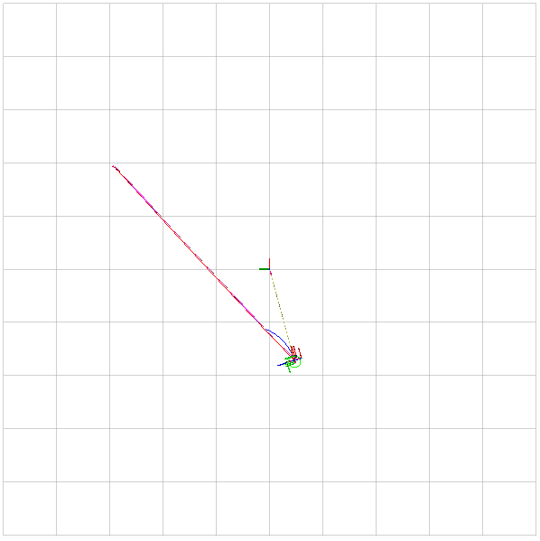
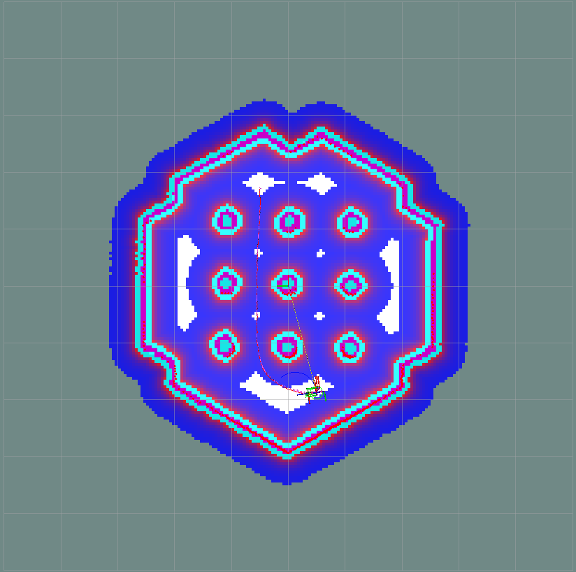
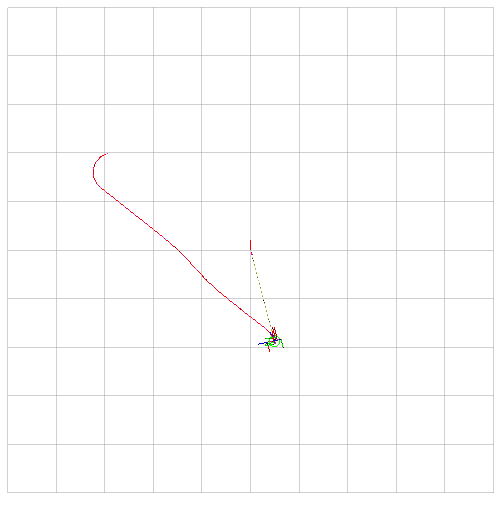
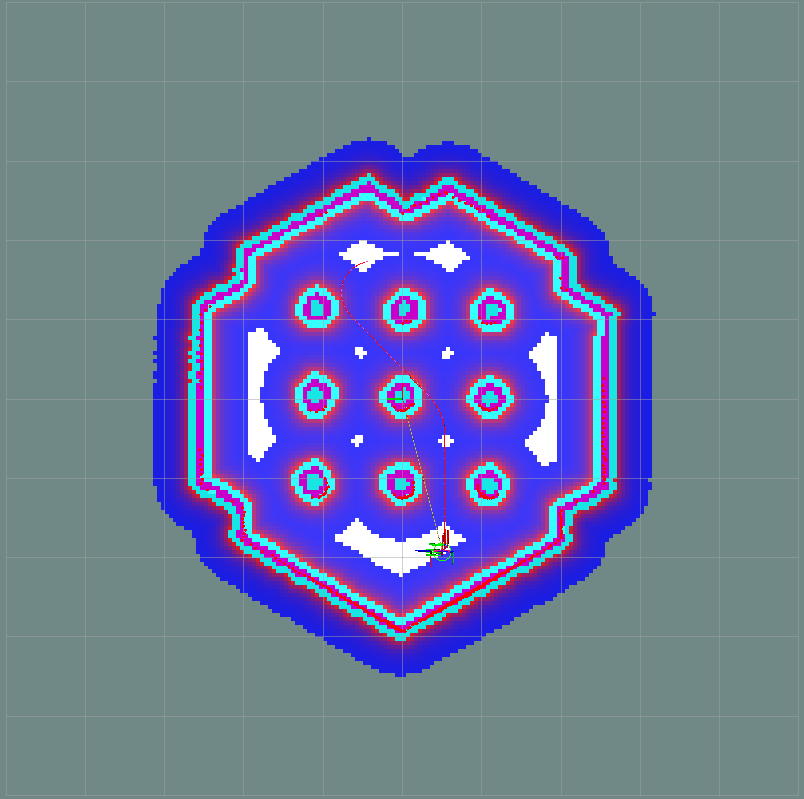
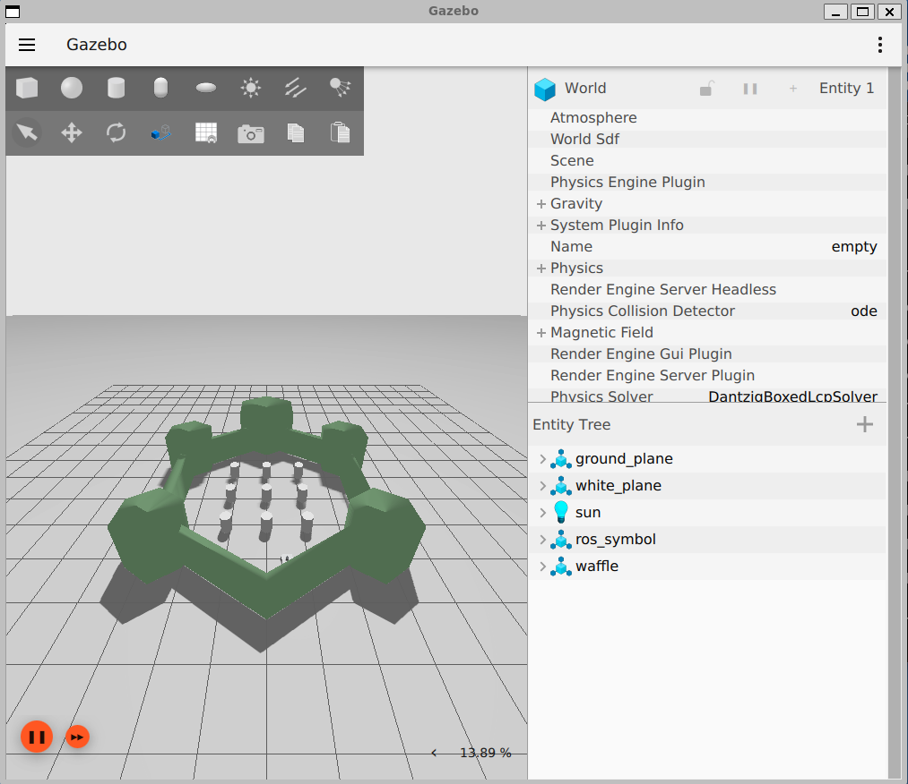

# Path Planning with Nav2

Autonomous goal-based navigation in simulation with the ROS 2 **Navigation Stack (Nav2)**, comparing two motion models — **differential drive** and **Ackermann steering** — in an empty world and in a world full of obstacles.

## Results

| | No obstacles | With obstacles |
| --- | --- | --- |
| **Differential drive** |  |  |
| **Ackermann steering** |  |  |

<p align="center"></p>

A differential-drive robot can turn on the spot, so the plain grid planner (NavFn) is enough. A car-like Ackermann vehicle has a minimum turning radius, so it uses the **Smac Hybrid-A\*** planner, which only produces paths the vehicle can actually drive.

## What's in here

| Path | Contents |
| --- | --- |
| `ros2_ws/src/turtlebot3/launch/` | Simulation, Nav2, robot state publisher and ROS ↔ Ignition bridge launch files |
| `ros2_ws/src/turtlebot3/params/diffdrive.yaml` | Nav2 config for differential drive (NavFn + DWB) |
| `ros2_ws/src/turtlebot3/params/accerPlanner.yaml` | Nav2 config for Ackermann steering (Smac Hybrid-A\* + DWB) |
| `ros2_ws/src/turtlebot3/maps/`, `models/` | Maps and Gazebo models |
| `create_empty_world.py` | Generates a blank occupancy map for the empty-world tests |
| `Path Planning with Nav2.pdf`, `parknchargenav2.pptx` | Presentation with a walkthrough of each Nav2 component |

## Tech stack

ROS 2 Humble · Nav2 · Ignition Gazebo (Fortress) · RViz · Docker

## Running it

On the host:

```bash
docker compose up -d
docker exec -it rosgazebo-container bash
```

Inside the container:

```bash
source /opt/ros/humble/setup.bash
cd ~/ros2_ws
colcon build --symlink-install
source install/setup.bash
export ROS_LOCALHOST_ONLY=1
export TURTLEBOT3_MODEL=waffle
ros2 launch turtlebot3 simulation.launch.py
```

Gazebo shows the robot in the world; in RViz, set a goal with **Nav2 Goal** and watch the global path, local path and costmaps update.

If `colcon build` fails on a fresh shell, re-run `export CMAKE_PREFIX_PATH=/opt/ros/humble` and source the setup file again.

## Author

Kartik Krishnan
